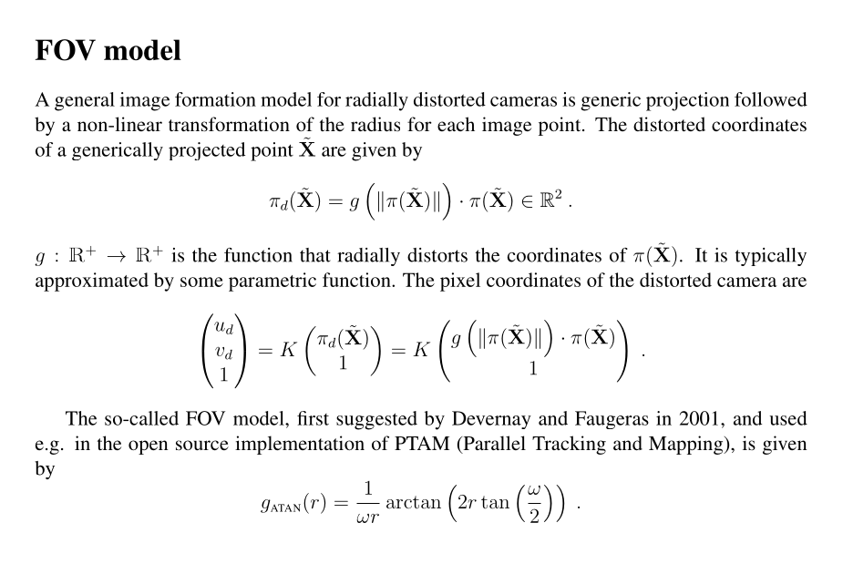

# Backprojection
- From image place space (3D, 2D + 1dim) to camera space (4D, 3D + 1dim)
- Multiply depth for homogenization
$$
[x_i, y_i, z_i]^T = z_i[x_{i'}, y_{i'}, 1]^T
$$
- Back projection by using inversed camera intrinsic to obtain camera space coordinate
$$
[x_c, y_c, z_c]^T = [\frac{x_i - cx}{f}, \frac{y_i - cy}{f}, z_i]^T
$$
- Projection
  - Scaling and translating by camera intrinsic parameters
    $$
    [x_{i}, y_{i}, z_{i}]^T = [f \cdot x_c + cx, f \cdot y_c + cy, z_c]^T 
    $$

- Given
  - Vertices with 2d generic coordinate
  - Camera intrinsic including camera image plane width and height
  - Transformation matrix

- Process
1. coordinates on image plane (generic coordinate)
2. Back projection to the cam1 coordinate
3. Transfrom the cam1 coordinate to the cam2 coordinate by multiplying with the transformation matrix.